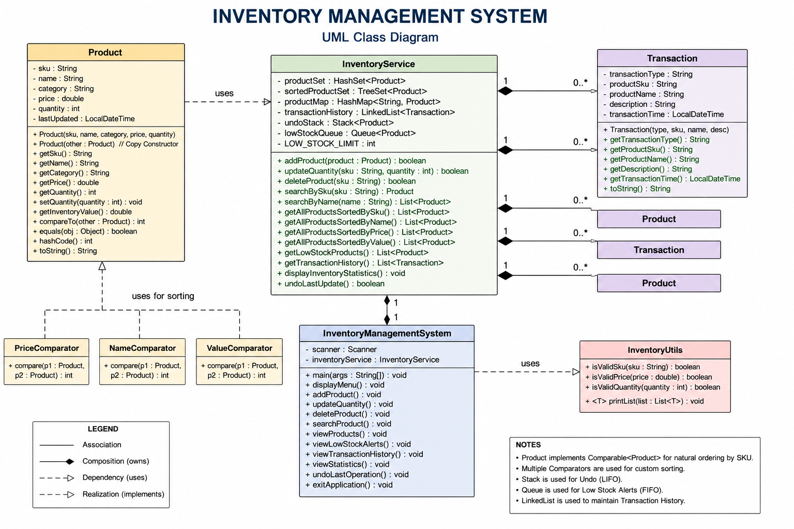
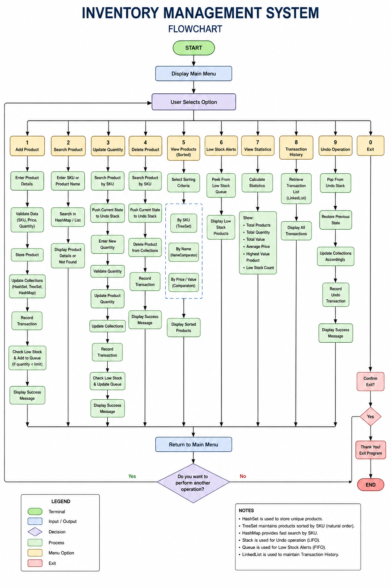

# Inventory Management System

## Project Overview

The Inventory Management System is a Java-based console application developed using Core Java, Maven, Advanced Collections Framework, Comparable, Comparator, Generic Programming, and Data Structure optimization.

The application helps users manage inventory efficiently by supporting product management, transaction tracking, low-stock monitoring, inventory statistics, and undo operations.

---

## UML Diagram



## Flowchart


## Features

### Product Management

* Add Product
* Update Product Quantity
* Delete Product
* Search Product by SKU
* Search Product by Name

### Sorting Operations

* Sort by SKU
* Sort by Name
* Sort by Price
* Sort by Inventory Value

### Inventory Monitoring

* Low Stock Alerts
* Inventory Statistics
* Highest Value Product Tracking

### Transaction Management

* Transaction History
* Audit Trail
* Undo Last Operation

---

## Technologies Used

* Java 17+
* Maven
* Java Collections Framework
* Comparable Interface
* Comparator Interface
* Generic Programming
* Object-Oriented Programming

---

## Collections Used

| Collection | Purpose                      |
| ---------- | ---------------------------- |
| HashSet    | Store unique products        |
| TreeSet    | Maintain sorted inventory    |
| LinkedList | Store transaction history    |
| Stack      | Implement undo functionality |
| Queue      | Manage low stock alerts      |
| HashMap    | Fast SKU lookup              |

---

## Project Structure

src/main/java/com/inventory

* model

    * Product.java
    * Transaction.java

* comparators

    * PriceComparator.java
    * NameComparator.java
    * ValueComparator.java

* service

    * InventoryService.java

* utils

    * InventoryUtils.java

* main

    * InventoryManagementSystem.java

---

## Inventory Statistics

The application provides:

* Total Products
* Total Quantity
* Total Inventory Value
* Average Product Price
* Highest Value Product
* Low Stock Product Count

---

## Time Complexity Analysis

| Operation       | Complexity |
| --------------- | ---------- |
| Add Product     | O(1)       |
| Search by SKU   | O(1)       |
| Delete Product  | O(1)       |
| Sorted Insert   | O(log n)   |
| Undo Operation  | O(1)       |
| Queue Operation | O(1)       |

---

## How to Run

### Clone Repository

```bash
git clone <repository-url>
```

### Navigate to Project

```bash
cd inventory-management-system
```

### Compile

```bash
mvn compile
```

### Run

```bash
mvn exec:java -Dexec.mainClass="com.inventory.main.InventoryManagementSystem"
```

---

## Key Concepts Demonstrated

* Collections Framework
* Data Structures
* Comparable
* Comparator
* Generic Programming
* Object-Oriented Design
* Time Complexity Analysis
* Maven Project Structure

---

## Future Improvements

* Database Integration
* GUI Interface
* REST API Support
* User Authentication
* Export Reports to PDF/Excel

---

## Author

Amrit Chandan Mishra

Java Developer | Core Java | Collections Framework | SQL
